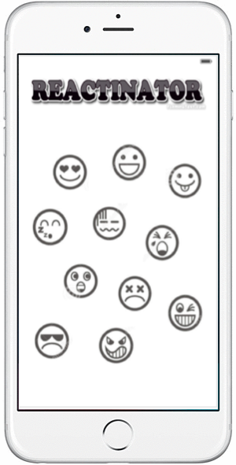

Reactinator
==========================


This is an iOS app that lets you react with 10 different and hilarious sounds!
This repository contains the Reactinator project that can be opened in XCode and instantly run on a simulator or a device.

## Requirements

* XCode 7.3 (or higher)
* iOS 9 SDK (or higher)

## Instructions

1. Get the code in this repository.
1. Double-click the  ```Reactinator.xcodeproj``` file.
1. Choose a Target and Device/Simulator combination from the Scheme menu and hit Run to run the application. 

## Issues

There are no known bugs.

## Licensing

Licensed under the Apache License, Version 2.0 (the "License");
you may not use this file except in compliance with the License.
You may obtain a copy of the License at

   http://www.apache.org/licenses/LICENSE-2.0

Unless required by applicable law or agreed to in writing, software
distributed under the License is distributed on an "AS IS" BASIS,
WITHOUT WARRANTIES OR CONDITIONS OF ANY KIND, either express or implied.
See the License for the specific language governing permissions and
limitations under the License.

A copy of the license is available in the repository's [license.txt]( https://github.com/jaystu/Reactinator/blob/master/LICENSE) file.
